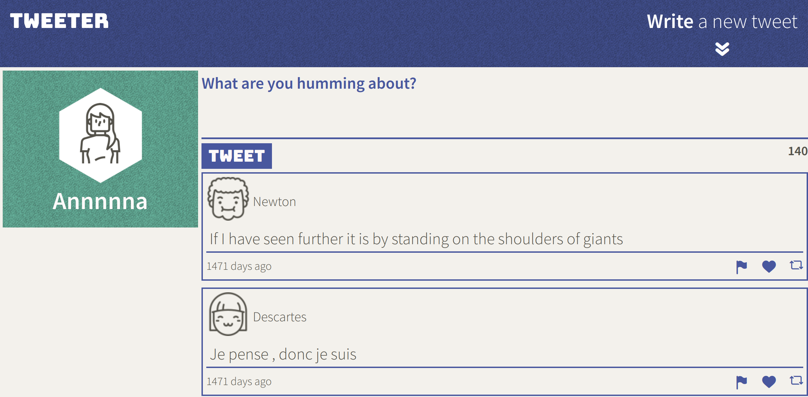
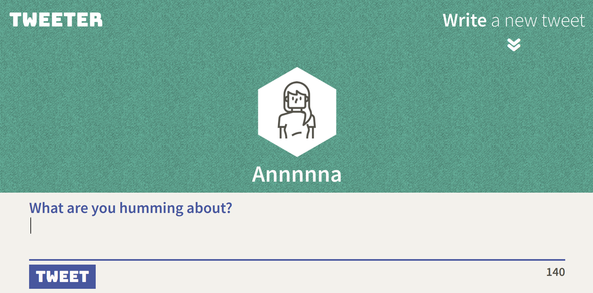

# Tweeter Project

Tweeter is a simple, single-page Twitter clone. It is built using jQuery (including AJAX), HTML5, and CSS3 (with all CSS built from scratch). 

The app supports two different layouts, desktop (when the viewport width is at least 1024px) and mobile.

Note, this app does not incorporate a database so the data does not persist.

## Screenshots

## Getting Started

1. Fork this repository, then clone your fork of this repository.
2. Install dependencies using the `npm install` command.
3. Start the web server using the `npm run local` command. The app will be served at <http://localhost:8080/>.
4. Go to <http://localhost:8080/> in your browser.

## Dependencies

- Express
- Chance
- Body-parser
- md5
- Node 5.10.x or above
